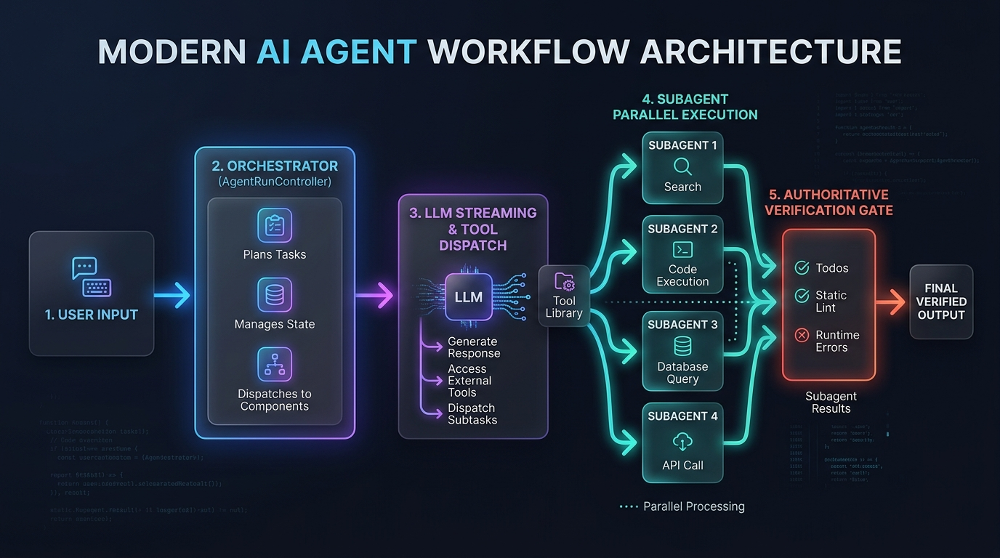
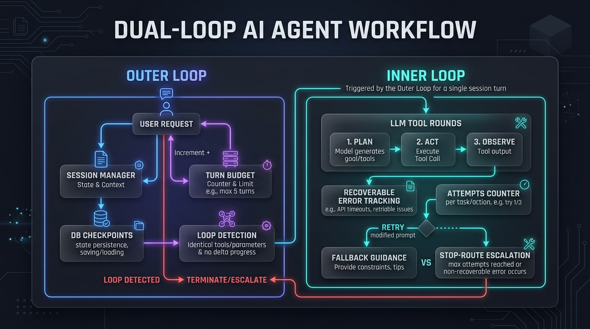
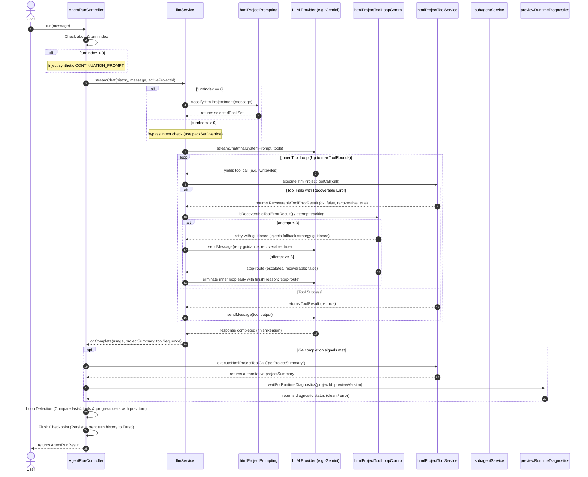

# EduCare Agent Workflow Architecture Documentation

This document provides a complete visual and structural explanation of the EduCare Agentic Workflow. It details how user inputs are orchestrated, executed, parallelized, and verified through a multi-turn process.

---

## 1. System Architecture Overview

The system operates as an autonomous agent loop that coordinates core services to complete coding tasks, compile preview results, run runtime diagnostics, and parallelize subtasks.

### A. High-Level Architecture Components



- **User Input**: The user submits a prompt via the UI, launching the agent session.
- **Orchestrator ([AgentRunController](../services/agentRunController.ts))**: Plans tasks, manages state tracking, and coordinates components.
- **LLM Streaming & Tool Dispatch ([llmService](../services/llmService.ts))**: Assembles prompts, manages provider streaming, and dispatches tool calls.
- **Subagent Parallel Execution ([subagentService](../services/subagentService.ts))**: Delegates up to 4 parallel sub-tasks to isolated subagents to optimize context and throughput.
- **Authoritative Verification Gate ([previewRuntimeDiagnostics](../services/previewRuntimeDiagnostics.ts))**: Validates project state (todos, static lints, runtime logs) before final output release.

---

## 2. Dual-Loop Workflow & States Infographic

EduCare employs a **dual-loop** control flow to manage execution safety, state persistence, error recovery, and loop containment.



### Core Loop Mechanisms Detailed Above:

#### 1. The Outer Loop (Session Level)

The Outer Loop manages the overall lifecycle of the user request across multiple turns (up to the turn budget, e.g., `maxTurns = 5`).

- **Session Manager**: Tracks history, configures the active project workspace, and loads prior context.
- **DB Checkpoints**: Automatically flushes state and chat history delta to Turso DB after each turn for persistence and seamless resumption.
- **Turn Budget**: Increments and limits execution steps. If reached without authoritative completion, it yields a clean budget exhaustion finish.
- **Loop Detection**: Compares consecutive turns. If the identical set of tools is invoked without any delta progress (completed todos remain unchanged), it triggers an early exit with state `failed` and finishReason `stop-route` to prevent infinite execution cycles.

#### 2. The Inner Loop (Turn Level)

For each session turn, an Inner Loop is triggered to process streaming chat, call tools, and handle API-level recoverable exceptions.

- **LLM Tool Rounds (Plan $\rightarrow$ Act $\rightarrow$ Observe)**: The LLM plans its actions, executes a tool, and observes the results in consecutive rounds (up to `maxToolRounds = 20` per turn).
- **Recoverable Error Tracking**: Monitors failures returned by the tools (e.g., file not found, syntax warnings, JSON parse errors).
- **Attempts Counter & Escalation**:
  - **Fallback Guidance (Attempts < 3)**: Injects detailed constraints, fallback advice, and repair instructions back to the LLM to guide self-correction.
  - **Stop-Route Escalation (Attempts $\ge$ 3)**: If the error persists after 3 retries, the loop escalates to stop execution, changes `recoverable` to `false`, yields an early exit with `finishReason: 'stop-route'`, and prompts the orchestrator for a different repair path.

---

## 3. Detailed Execution Flow (Flowchart)

Below is the turn-by-turn workflow sequence depicting initialization, intent classification, multi-turn tool loops, subagent spawning, and termination checks:

```mermaid
flowchart TD
    Start([User Prompt Entered]) --> Init[Initialize AgentRunController & Turn 0]

    subgraph OuterLoop [Outer Multi-Turn Loop (Up to maxTurns)]
        CheckAbort{Is Aborted?} -- Yes --> TerminalAbort[Abort / Stop Run]
        CheckAbort -- No --> TurnStart[Turn Start Callback & State Change]

        IsCont{Is turnIndex > 0?}
        IsCont -- Yes --> InjectPrompt[Inject CONTINUATION_PROMPT as synthetic User Msg]
        IsCont -- No --> UseOriginalMsg[Use original User Message]

        InjectPrompt & UseOriginalMsg --> IntentClassification[Classify Intent & Select Tool Packs]
        IntentClassification --> StreamChat[Invoke Provider streamChat]

        subgraph InnerLoop [Inner Tool Execution Loop (Up to maxToolRounds)]
            StreamChat --> ModelDecision{LLM Response?}
            ModelDecision -- Text Chunk --> YieldChunk[Yield Text Chunk to UI] --> StreamChat
            ModelDecision -- Tool Calls --> CheckInnerBudget{toolRoundCount >= maxToolRounds?}

            CheckInnerBudget -- Yes --> ExitInnerBudget[Yield finishReason: 'tool-budget-exhausted']
            CheckInnerBudget -- No --> ExecuteToolCalls[Execute Tool Calls]

            subgraph ToolErrorHandling [Tool Execution & Recovery Contract]
                ExecuteToolCalls --> ToolOutcome{Tool Success?}
                ToolOutcome -- Success (ok) --> ReturnToolOk[Return Normal Result to LLM]
                ToolOutcome -- Recoverable Error --> TrackAttempt[Increment Attempt Count for Error Code]

                TrackAttempt --> CheckAttemptCount{Attempt Count >= 3?}
                CheckAttemptCount -- No (Attempt < 3) --> RetryWithGuidance[Return Result with Fallback Guidance\nMark recoverable: true] --> ReturnToolOk
                CheckAttemptCount -- Yes (Attempt >= 3) --> EscalateStopRoute[Escalate to Stop Route\nMark recoverable: false\nSet stopRoute = true]
            end

            ReturnToolOk --> SendToLLM[Send tool parts back to LLM via sendMessage] --> StreamChat
            EscalateStopRoute --> ExitInnerEscalate[Yield finishReason: 'stop-route'\nOutput repair feedback message]
        end

        ModelDecision -- Complete / End Stream --> TurnEnd[Turn Complete Callback]
        ExitInnerBudget & ExitInnerEscalate & TurnEnd --> CheckOuterProgress[Check Turn Progress]

        CheckOuterProgress --> LoopDetect{Loop Detected?\n- Consecutive turns with identical last 4 tools\n- AND 0 project todo completion delta}

        LoopDetect -- Yes --> TermLoopFail[Mark status: 'failed'\nfinishReason: 'stop-route'\nloopDetected: true]

        LoopDetect -- No --> G4VerifyNeeded{Model complete OR finishReason complete OR all todos done?}

        G4VerifyNeeded -- Yes --> AuthoritativeVerify[Run Authoritative Verification\nChecks todos complete & preview & runtime logs]
        G4VerifyNeeded -- No --> IncrementTurn[Increment turnIndex & Flush Checkpoint]

        AuthoritativeVerify -- Verification Passes --> TermComplete[Mark status: 'complete'\nfinishReason: 'complete']
        AuthoritativeVerify -- Verification Fails --> IncrementTurn

        IncrementTurn --> CheckMaxTurns{turnIndex >= maxTurns?}
        CheckMaxTurns -- Yes --> TermBudgetComplete[Mark status: 'complete'\nfinishReason: last_turn_reason\n(Budget Exhausted)]
        CheckMaxTurns -- No --> CheckAbort
    end

    TerminalAbort & TermLoopFail & TermComplete & TermBudgetComplete --> EndRun([Return AgentRunResult])
```

---

## 4. Component Interaction Sequence Diagram

This sequence diagram outlines the chronological interaction flow between components during tool loops, subagent delegation, error escalation, and verification:



---

## 5. Key Loop & State Breakdowns

### A. Outer Multi-Turn Loop (Managed by `AgentRunController`)

- **State Tracker (`AgentRunState`)**: Manages `runId`, `status` (`'running' | 'complete' | 'failed' | 'stopped' | 'aborted'`), `turnIndex`, `maxTurns`, `todoSummary`, and `previewDiagnosticState`.
- **Continuation & Token Management**:
  - If `turnIndex > 0`, prepends `CONTINUATION_PROMPT` to history as a synthetic user message: _"Continue working on the open todos until all are complete and the preview has no runtime errors, then call reportTurnOutcome(outcome:"complete")."_
  - Packs and saves a checkpoint containing the committed history delta, partial text, tool traces, and accumulated prompt/candidate tokens after every turn.
- **Session-Level Loop Detection**:
  - Tracks the list of tools used across turns (`state.toolTrace`).
  - If **two consecutive turns** yield identical sequences of the last 4 tools, and the completed todo count (`todoSummary.completed`) does not increase, the run terminates immediately.
  - State transition: `running` $\rightarrow$ `failed` (finishReason: `'stop-route'`, `loopDetected: true`).

### B. Inner Tool Execution Loop (Managed by LLM Provider Contract)

- **Budgeting**: The model can run up to `maxToolRounds` (default 20) per turn. If exceeded, it yields `finishReason: 'tool-budget-exhausted'` and completes the turn.
- **Recoverable Error Escalation (`htmlProjectToolLoopControl`)**:
  - Tracks repeated failures of the same tool with the same error code (`attempt`).
  - **Fallback Path (Attempt < 3)**: Returns specific fallback guidance in the tool results payload to guide the model on a different approach (e.g. _"Inspect the file first, then switch to replaceInFile instead of another large write."_).
  - **Escalation Path (Attempt >= 3)**: If the model repeatedly makes the same error 3 times, `loopAction` escalates to `'stop-route'`, yielding a repair feedback notice to the UI, setting `recoverable: false`, and terminating the turn early with `finishReason: 'stop-route'`.

### C. Subagent Parallel Execution (`subagentService`)

- **Concurrency**: Spawns up to 4 parallel subagents via `runSubagentBatch`.
- **Tool Caps**: Subagents are restricted from calling the `bootstrap` pack or harness tools (like `reportTurnOutcome` or snapshots).
- **Write Collisions**: Only **one** subagent in a batch is allowed write-capable HTML packs (e.g. `edit` or `todo_finalize`) to avoid parallel write conflicts.

### D. Authoritative Verification Gate

Triggered if the model executes `reportTurnOutcome`, the finish reason is `complete`, or all project todos are finished.

- Bypasses the model's text assessment entirely.
- Executes `getProjectSummary` to inspect the actual filesystem state.
- Queries `waitForRuntimeDiagnostics` to check browser compilation status.
- Verification passes **only** if:
  $$\text{todosCompleted} \land \text{noPreviewErrors} \land \text{runtimeDiagnosticsClean}$$
- If verification fails, it is marked as a **false-complete** and the agent proceeds to the next turn for repair.
