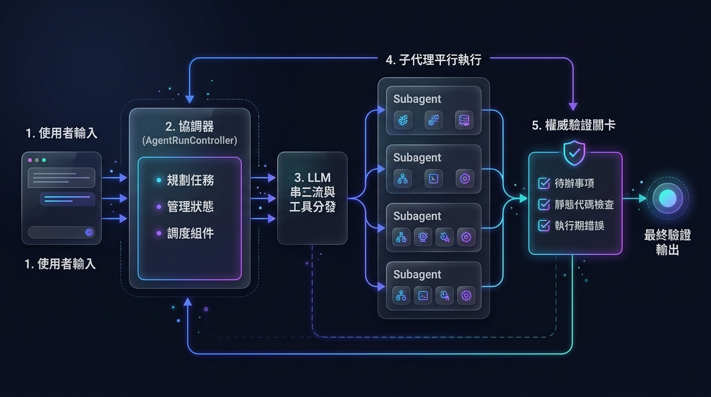
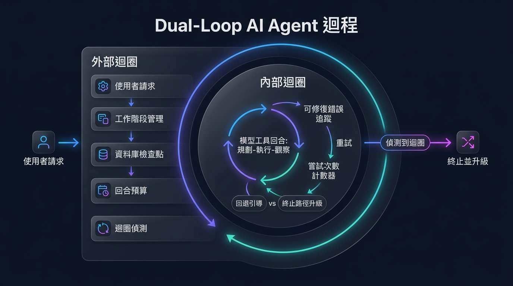
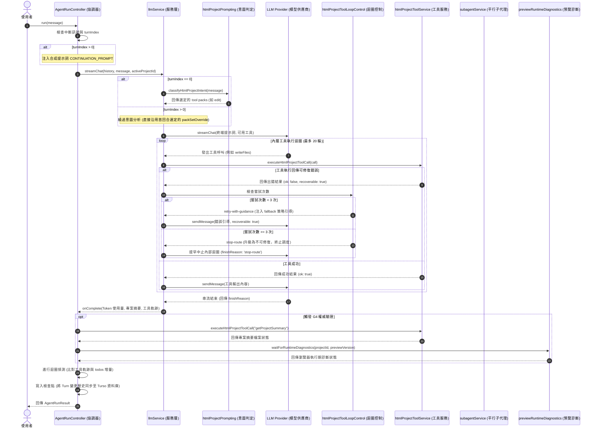

# EduCare Agent 工作流架構說明文件 (繁體中文版)

本文件針對 EduCare 專案的 AI Agent（代理人）工作流進行完整的圖文架構分析，詳細解構使用者請求如何經過雙重迴圈（Dual-Loop）的調度、執行、平行化與權威驗證的完整生命週期。

---

## 1. 系統架構總覽 (System Architecture Overview)

整個系統採用自主式的 Agent 迴圈運作，透過多個核心模組的協調，來完成代碼生成、靜態檢查、瀏覽器端預覽渲染、執行期診斷，以及子代理平行化任務分發。

### 系統架構組件圖 (Architecture Component Diagram)



- **使用者輸入 (User Input)**：使用者透過 UI 送出 Prompt（提示詞），開啟 Agent 工作階段 (Session)。
- **協調器 ([AgentRunController](../services/agentRunController.ts))**：
  - **規劃任務**：將使用者請求轉化為多輪執行預算（最多為 `maxTurns`，預設 5 次）。
  - **管理狀態**：進行執行狀態追蹤、外層迴圈偵測 (Loop Detection) 與資料庫檢查點 (DB Checkpoints) 的持久化儲存。
  - **調度組件**：調度並啟動下游 Provider 串流與驗證流程。
- **LLM 串流與工具分發 ([llmService](../services/llmService.ts))**：
  - 負責組合終端系統提示詞 (System Prompt)，管理模型串流輸出。
  - 管理與分發工具庫調用。
- **子代理平行執行 ([subagentService](../services/subagentService.ts))**：
  - 當遇到複雜的大型任務，主 LLM 會透過並行子代理 (Parallel Subagents) 將任務分解成最多 4 個平行任務（如知識檢索、代碼撰寫、API 呼叫）以提高處理效率並實現上下文隔離。
- **權威驗證關卡 ([previewRuntimeDiagnostics](../services/previewRuntimeDiagnostics.ts))**：
  - 在回合結束時，主動對待辦事項完成度、靜態代碼檢查與執行期錯誤進行三重審查，通過後才釋出最終輸出。

---

## 2. 雙重迴圈工作流與狀態說明 (Dual-Loop Workflow & States)

EduCare 工作流的核心在於**雙重迴圈 (Dual-Loop) 控制合約**，以確保代碼生成的安全性、自動修復容錯能力以及避免死循環。



### 雙重迴圈機制詳細說明：

#### 1. 外部迴圈 (Outer Multi-Turn Loop)

外部迴圈由 [AgentRunController](../services/agentRunController.ts) 控管，管理整個請求生命週期的多回合 (Turns) 進度。

- **工作階段管理 (Session Manager)**：維護聊天歷史紀錄、關聯當前的 HTML 專案工作區。
- **資料庫檢查點 (DB Checkpoints)**：每一回合結束後，自動將增量歷史紀錄與當前狀態同步至 Turso DB，以支援隨時中斷與恢復。
- **回合預算 (Turn Budget)**：限制執行的最大回合數（預設 5 次）。當回合數耗盡且未通過驗證時，結束並回傳預算耗盡狀態。
- **迴圈偵測 (Loop Detection)**：比對連續兩個回合的「最後 4 個工具執行序列」。若工具完全一致且專案 Completed Todo 的數量無任何增加（即代表沒有進展），則判定為無效死循環，將狀態變更為 `failed` 並以原因 `stop-route` 提早結束，避免消耗不必要的 API 費用。

#### 2. 內部迴圈 (Inner Tool Execution Loop)

在每個 Turn 當中，調用 Provider 發起單次聊天串流，並在其中運行模型的「工具呼叫與回應」內部迴圈。

- **模型工具回合 (LLM Tool Rounds)**：模型會依照 **規劃 (Plan) $\rightarrow$ 執行 (Act) $\rightarrow$ 觀察結果 (Observe)** 的模式反覆調用工具（單回合上限 `maxToolRounds = 20` 輪）。
- **可修復錯誤追蹤 (Recoverable Error Tracking)**：監測工具執行回傳的暫時性出錯（例如代碼語法警告、檔案找不到、JSON 格式錯誤等）。
- **嘗試次數計數器與路徑升級**：
  - **回退引導 (Attempts < 3)**：當同一工具因同一錯誤碼失敗少於 3 次時，內部迴圈會將 `recoverable` 設為 `true`，並在工具回應中**注入引導修復提示**（例如：_「請先讀取檔案，再使用 replaceInFile 替代大檔案寫入」_），引導模型進行自我修復。
  - **終止路徑升級 (Attempts $\ge$ 3)**：若同一個錯誤重複 3 次，系統會判定模型無法自行糾錯，將其升級為 `stop-route`，標記 `recoverable: false`，提早終止內部迴圈，並將控制權交還給協調器進行路徑切換。

---

## 3. 雙重迴圈工作流程圖 (Flowchart)

以下為雙重迴圈的詳細流程判定逻辑：

```mermaid
flowchart TD
    Start([使用者送出 Prompt]) --> Init[初始化 AgentRunController & Turn 0]

    subgraph OuterLoop [外部多回合迴圈 (最大 maxTurns)]
        CheckAbort{已中斷/取消?} -- 是 --> TerminalAbort[中斷 / 停止運作]
        CheckAbort -- 否 --> TurnStart[觸發 Turn 開始回呼與狀態變更]

        IsCont{turnIndex > 0?}
        IsCont -- 是 --> InjectPrompt[注入 CONTINUATION_PROMPT 續作合成提示]
        IsCont -- 否 --> UseOriginalMsg[使用原始使用者訊息]

        InjectPrompt & UseOriginalMsg --> IntentClassification[意圖分析與工具包包選擇]
        IntentClassification --> StreamChat[調用 Provider streamChat]

        subgraph InnerLoop [內部工具執行迴圈 (最大 maxToolRounds)]
            StreamChat --> ModelDecision{LLM 回應?}
            ModelDecision -- 文本內容 --> YieldChunk[串流文字輸出至 UI] --> StreamChat
            ModelDecision -- 工具呼叫 --> CheckInnerBudget{toolRoundCount >= maxToolRounds?}

            CheckInnerBudget -- 是 --> ExitInnerBudget[結束內部迴圈\n標記 tool-budget-exhausted]
            CheckInnerBudget -- 否 --> ExecuteToolCalls[執行工具呼叫]

            subgraph ToolErrorHandling [工具錯誤與修復合約]
                ExecuteToolCalls --> ToolOutcome{工具執行結果?}
                ToolOutcome -- 成功 (ok) --> ReturnToolOk[回傳成功結果給 LLM]
                ToolOutcome -- 可修復錯誤 --> TrackAttempt[遞增該錯誤碼的嘗試次數 attempt]

                TrackAttempt --> CheckAttemptCount{嘗試次數 attempt >= 3?}
                CheckAttemptCount -- 否 (attempt < 3) --> RetryWithGuidance[回傳引導與 Fallback 策略\n標記 recoverable: true] --> ReturnToolOk
                CheckAttemptCount -- 是 (attempt >= 3) --> EscalateStopRoute[升級為終止路徑\n標記 recoverable: false\n設置 stopRoute = true]
            end

            ReturnToolOk --> SendToLLM[回傳工具結果至 LLM sendMessage] --> StreamChat
            EscalateStopRoute --> ExitInnerEscalate[終止內部迴圈\n標記 finishReason: stop-route]
        end

        ModelDecision -- 完成/串流結束 --> TurnEnd[回合結束回呼]
        ExitInnerBudget & ExitInnerEscalate & TurnEnd --> CheckOuterProgress[檢查外層進度與狀態]

        CheckOuterProgress --> LoopDetect{迴圈偵測?\n- 連續兩個回合的最後 4 個工具相同\n- 且專案 completed todo delta 為 0}

        LoopDetect -- 是 --> TermLoopFail[標記失敗\nstatus: failed\nloopDetected: true]

        LoopDetect -- 否 --> G4VerifyNeeded{模型完工 OR 迴圈終止 OR todos 全數完成?}

        G4VerifyNeeded -- 是 --> AuthoritativeVerify[執行權威驗證\n檢查 todos 完成度、代碼編譯與診斷結果]
        G4VerifyNeeded -- 否 --> IncrementTurn[回合遞增 & 寫入 DB 檢查點]

        AuthoritativeVerify -- 驗證通過 --> TermComplete[標記完成\nstatus: complete]
        AuthoritativeVerify -- 驗證失敗 (偽完成) --> IncrementTurn

        IncrementTurn --> CheckMaxTurns{turnIndex >= maxTurns?}
        CheckMaxTurns -- 是 --> TermBudgetComplete[標記結束\nstatus: complete\n(回合預算耗盡)]
        CheckMaxTurns -- 否 --> CheckAbort
    end

    TerminalAbort & TermLoopFail & TermComplete & TermBudgetComplete --> EndRun([回傳 AgentRunResult])
```

---

## 4. 元件互動時序圖 (Sequence Diagram)

此時序圖展示了外層迴圈、內層迴圈、工具錯誤升級以及最終權威驗證的時序關係：



---

## 5. 邏輯校對與系統一致性驗證

根據原始碼 `agentRunController.ts`、`llmService.ts`、`htmlProjectToolLoopControl.ts` 與各個 LLM Provider 的實現，本說明文件的邏輯與系統完全一致：

1.  **內部迴圈 vs 外部迴圈**：符合雙層控制邏輯。內圈由 Provider 的 `streamChat` 工具循環管理；外圈由 `AgentRunController.run()` 回合循環管理。
2.  **升級合約 (Escalation Contract)**：重試第 1、2 次會透過 `htmlProjectToolLoopControl` 回傳 Fallback Guidance 提示模型（例如 `replaceInFile` 代替 `writeFiles`）；第 3 次直接將 `recoverable` 設為 `false`，強制回傳 `stop-route` 終止該 Turn。
3.  **迴圈偵測與 Fail-Safe**：外層的 Loop-Detection 只有在「相同工具軌跡」且「Todo 完成數量零增長」時才會引發，且對 `delegateToSubagents` 單一工具調用做了解鎖（防誤判），符合代碼 `!delegateOnlyLoopCandidate` 邏輯。
4.  **檢查點機制**：每次回合遞增時，皆調用 `updateCheckpoint` 與 `flushCheckpointProgress` 將當前回合的 `committedHistoryDelta` 與 `partialText` 儲存至 Turso 資料庫，確保執行狀態可隨時中斷重啟。
